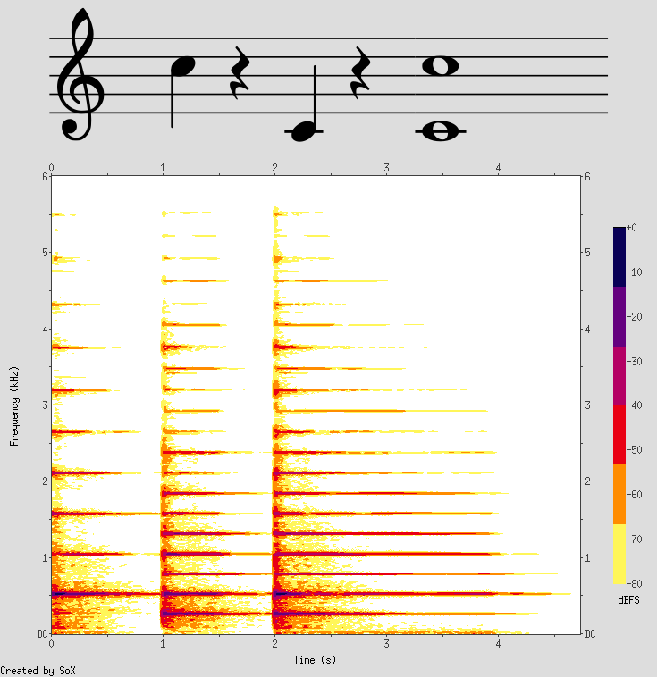
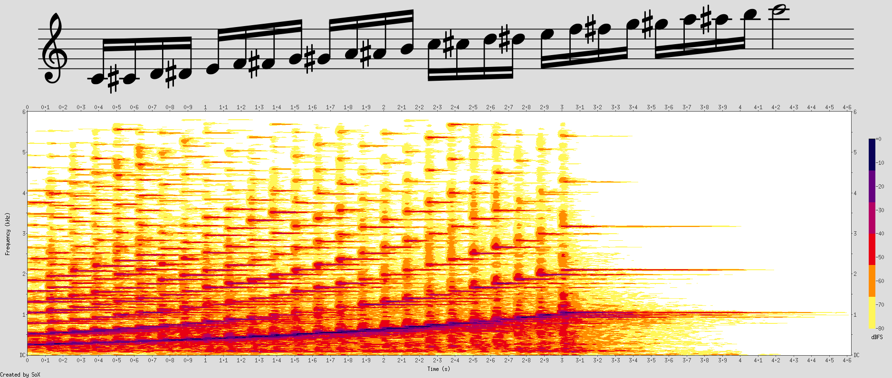
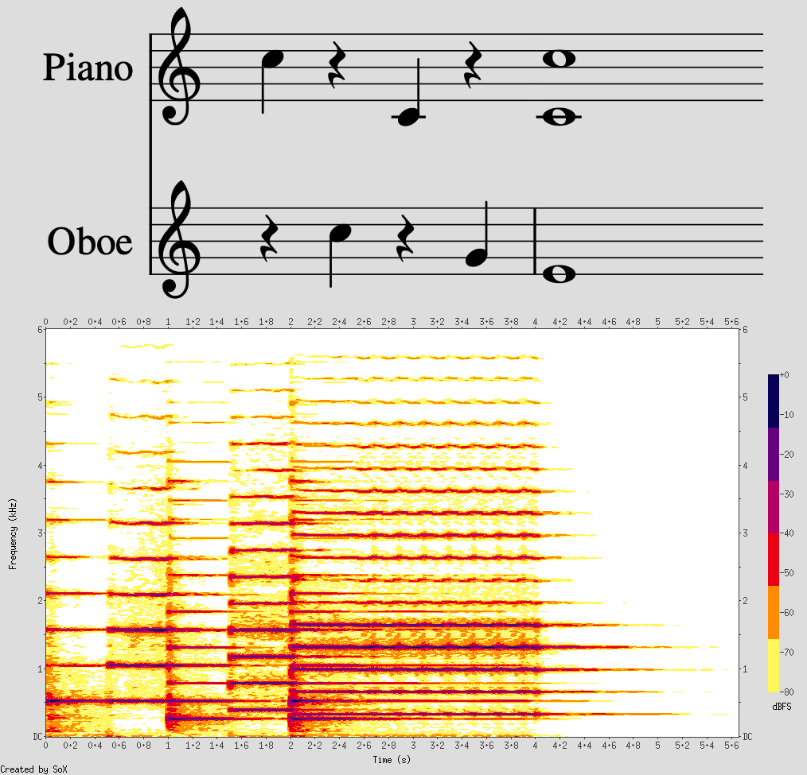

## Spectrogram Examples

This file has examples to test the capabilities of the export script, which, given a .mscz/.mscx file, exports:
 - a combined PNG image of the score and a spectrogram of the score, stacked vertically
 - an mp3 of the score being played

## Example 1: Basic
<audio controls="" class="full-width" id="audio-player"><source src="measureless_template.mp3" type="audio/mpeg">Your browser does not support a built in audio player.</audio>

## Example 2: Long chromatic
<audio controls="" class="full-width" id="audio-player"><source src="chromatic.mp3" type="audio/mpeg">Your browser does not support a built in audio player.</audio>

## Example 3: Two instruments
<audio controls="" class="full-width" id="audio-player"><source src="two_instruments.mp3" type="audio/mpeg">Your browser does not support a built in audio player.</audio>
