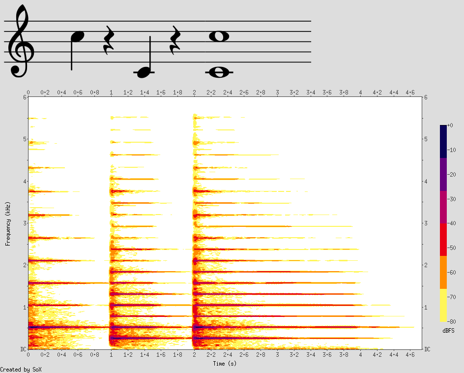

## Spectrogram Music Theory

Math with Long Roman Numerals is like counting US coinage. Twenty cents can be written as twenty pennies (`IIIIIIIIIIIIIIIIIIII`), or as 4 nickels (`VVVV`), or as a mix of pennies, dimes, and nickels, in any order you like (`IIVIIXI`). Test time: What's `IVIX` + `IIGI`? It's `IVIXIIGI`! Pretty easy, even without having any idea what that G is doing there. You can change out those five pennies for a nickel if you don't want so much loose change.

<audio controls="" class="full-width" id="audio-player"><source src="measureless_template.mp3" type="audio/mpeg">Your browser does not support a built in audio player.</audio>

Now let us count with notes. Perhaps we think of the ascending C-major scale first: `C`, `D`, `E`, `F`, `G`, `A`, `B`, `C`. The difference between `C` and `D`, the first and second notes, is a whole step. The difference between `E`, and `F`, the third and fourth notes, is a half step. 

Why do I have to remember that some gaps are smaller than others?

The differences between notes in any ascending major scale is whole, whole, half, whole, whole, whole, half. To count the half steps, +2, +2, +1, +2, +2, +2, +1.

*Critique #1*: The music theory vocabulary measures small pitch differences in _steps_, which is not the most fundamental unit musicians interact with.

Let's count up in musical intervals: minor second, major second, minor third, major third, perfect fourth, augmented fourth, perfect fifth, minor sixth, major sixth, minor seventh, major seventh, perfect octave.

*Critique #2*: The music theory vocabulary measures intervals including both end notes. The reason this is a terrible idea can be easily seen in the word "octave".

An "Octave" (8th) is so named because there are eight diatonic notes in the scale, _when you count the start and end notes_. What do you think the interval of two octaves should be called? There are only 15 diatonic notes (including the end note), rather than the 8\*2 one might expect. How about three octaves? Four? Eight to an octave doesn't add up, but seven serves nicely. 

Most music theorists learn to dissociate math from music theory, because music theory of intervals is antithetical even to basic counting: If you raise a whole step, and you raise a whole step again, how far have you raised? One too many. 

*Alternative*: Express all intervals in half steps. There are 12 half steps before an octave repeats, just as there are 12 hours on the clock. So if you have to deal with 14 half steps, you know it's just an octave and two more. The student still has to learn which intervals are major or minor, but that has to be learned either way, whether it's in the interval names or not.

The underlying principle here is: Don't use a more complicated vocabulary when numbers can completely define the thing. A tritone/augmented fourth/diminished fifth can serve a variety of purposes and has so much musical significance, and it's ok not to cram all of it into the interval's name, because fundamentally, it's just 6 half steps.

(Kudos to whoever named the tritone though. It is _actually_ an interval of 3 whole steps. I guess interval names are not consistently inconsistent!)

I'll be using half steps to specifify intervals from here on out.

I am eternally grateful that at least the way we talk about musical rhythm doesn't render counting impossible. A quarter and a quarter is a half, and all is right with the world (except the decision to make the "whole" note the linguistically fundamental "unit")

Consider the note named `F`. Let's say we want one more than `F`. We aren't the Romans, with their barbaric incrementing tally mark, so we increment to the next musical unit with our highly sophisticated symbol `#`, giving us `F#`. What 


You can use the [editor on GitHub](https://github.com/kenanbit/aeolian-digits/edit/master/README.md) to maintain and preview the content for your website in Markdown files.

Whenever you commit to this repository, GitHub Pages will run [Jekyll](https://jekyllrb.com/) to rebuild the pages in your site, from the content in your Markdown files.

### Markdown

Markdown is a lightweight and easy-to-use syntax for styling your writing. It includes conventions for

```markdown
Syntax highlighted code block

# Header 1
## Header 2
### Header 3

- Bulleted
- List

1. Numbered
2. List

**Bold** and _Italic_ and `Code` text

[Link](url) and 
```

For more details see [GitHub Flavored Markdown](https://guides.github.com/features/mastering-markdown/).

### Jekyll Themes

Your Pages site will use the layout and styles from the Jekyll theme you have selected in your [repository settings](https://github.com/kenanbit/aeolian-digits/settings). The name of this theme is saved in the Jekyll `_config.yml` configuration file.

### Support or Contact

Having trouble with Pages? Check out our [documentation](https://help.github.com/categories/github-pages-basics/) or [contact support](https://github.com/contact) and we’ll help you sort it out.
